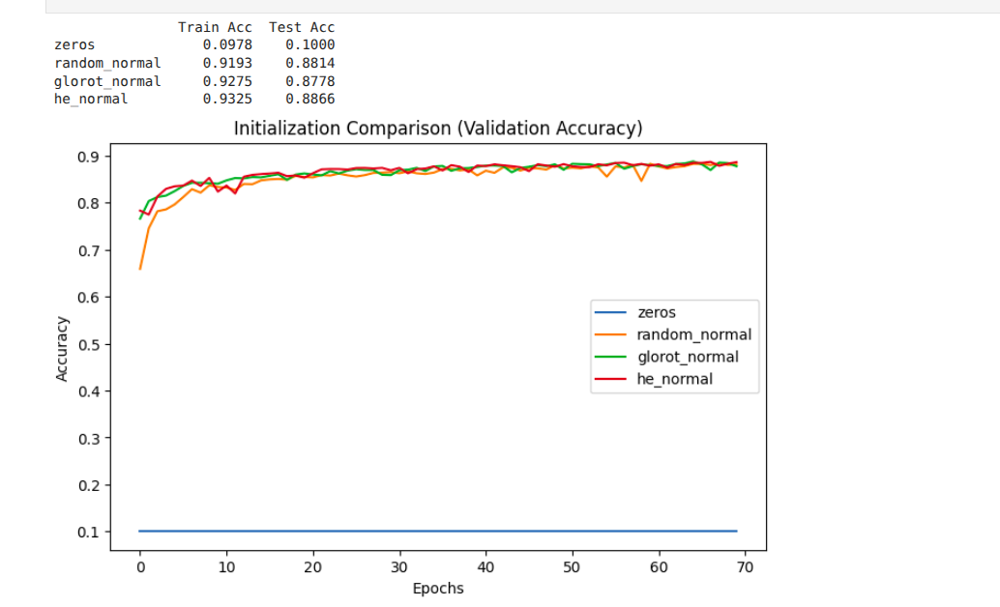
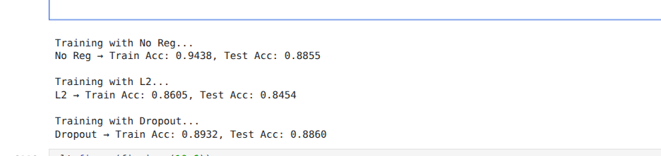

Initialization Experiment

Setup:
    Tested: Zeros, Random Normal, Xavier (Glorot), He   
    Model: 4-layer NN [784, 128, 64, 10] (ReLU activations, Softmax output)   
    Optimizer: SGD (learning_rate = 0.01)   
    Epochs: 70  
    Batch size: 128

Results:

| Initializer     | Train Acc | Test Acc | Notes                          |
| --------------- | --------- | -------- | ------------------------------ |
| Zeros           | 0.0978    | 0.1000   | Failed due to symmetry         |
| Random Normal   | 0.9193    | 0.8814   | Learns but less stable         |
| Glorot (Xavier) | 0.9275    | 0.8778   | Good, but not optimal for ReLU |
| He Normal       | 0.9325    | 0.8866   | Fastest convergence, best test |

Summary:
Zero intitializatoin failed completely, Random Normal, Xavier, He did simillarly good resutls
with Xavier and He being slightly better

################################################################################################

Regularization Experiment

Setup:
    Tested: No Regularization, L2 (λ=0.005), Dropout (0.45)   
    Model: 5-layer NN [784, 512, 256, 128, 64, 10] (ReLU activations, Softmax output)    
    Optimizer: SGD (learning_rate = 0.01)    
    Epochs: 150    
    Batch size: 128

Results:

| Method         | Train Acc | Test Acc | Notes                    |
| -------------- | --------- | -------- | ------------------------ |
| No Reg         | 0.9438    | 0.8855   | Overfits, large gap      |
| L2 (0.005)     | 0.8605    | 0.8454   | Too strong, underfits    |
| Dropout (0.45) | 0.8932    | 0.8860   | Best balance/generalizes |

Summary: 

- The unregularized model achieved the highest training accuracy but showed overfitting, with low bias but high variance (large gap between training and test performance).
- With L2 regularization with λ=0.005 was too strong and led to underfitting, increasing bias while reducing variance.
- With Dropout at 0.45 provided the best generalization, introducing moderate bias but significantly reducing variance, resulting in nearly equal train and test accuracy.

## Conclusion  

These experiments highlight the importance of good practices in neural network training:  

- **Initialization matters**: Zero initialization failed completely due to symmetry, while He initialization provided the fastest convergence and best generalization for ReLU-based networks.  
- **Regularization is essential**: Without it, the model overfit (low bias, high variance). L2 regularization with a strong λ increased bias and caused underfitting. Dropout achieved the best tradeoff, adding some bias but significantly reducing variance.  
- **Bias–Variance tradeoff**: The results clearly demonstrate how initialization and regularization influence bias and variance, and why finding the right balance is critical for strong generalization.  

Overall, this project shows that model design is not only about architecture depth, but also about careful choices of initialization and regularization strategies.  

